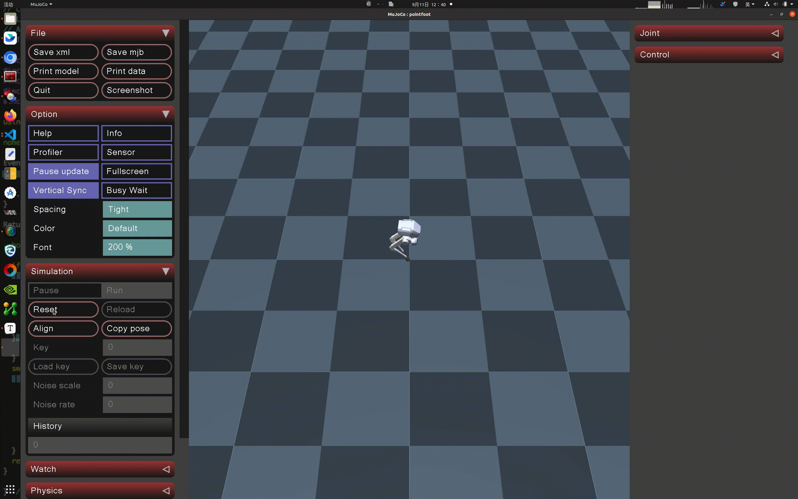

# humanoid-mujoco-sim

LimX 人形机器人（HU_D03、HU_D04）的 MuJoCo 仿真环境。用于可视化机器人模型、测试运动控制器、在仿真中验证 RL 策略后再部署到真机。

## 1. 快速开始

### 前提条件

- Python 3.8 或更高版本
- Linux (x86_64)

> 内置的 `prebuild/kinematic_projection` 辅助程序仅支持 x86_64。aarch64 用户可安装 limxsdk wheel，但仿真功能将受限。

### 安装

```bash
# 克隆仓库及子模块（HTTPS）
git clone --recurse-submodules https://github.com/limxdynamics/humanoid-mujoco-sim.git
cd humanoid-mujoco-sim

# 安装依赖
pip install -r requirements.txt

# 安装 LimX 运动控制 SDK
pip install limxsdk-lowlevel/python3/amd64/limxsdk-*-py3-none-any.whl
```

### 设置机器人型号

可用型号：`HU_D03_03`、`HU_D04_01`

```bash
echo 'export ROBOT_TYPE=HU_D04_01' >> ~/.bashrc && source ~/.bashrc
```

### 运行

```bash
python simulator.py
```

你会看到机器人站立在 MuJoCo 窗口中。使用鼠标右键拖拽旋转视角，滚轮缩放。

## 2. 仿真操控

| 按键 | 操作 |
|-----|--------|
| `Tab` | 切换左右 UI 面板 |
| `Space` | 暂停 / 恢复仿真 |
| 右键 + 拖拽 | 旋转摄像机 |
| 滚轮 | 缩放 |

## 3. 虚拟摇杆

使用内置的虚拟摇杆交互控制机器人：

```bash
# Linux
./robot-joystick/robot-joystick
# Windows
robot-joystick/robot-joystick.exe
```

## 4. 仿真演示



## 5. 相关仓库

- [humanoid-description](https://github.com/limxdynamics/humanoid-description) — 机器人模型文件（URDF/MuJoCo）
- [humanoid-rl-deploy-python](https://github.com/limxdynamics/humanoid-rl-deploy-python) — Python RL 策略部署
- [humanoid-rl-deploy-cpp](https://github.com/limxdynamics/humanoid-rl-deploy-cpp) — 无 ROS 依赖的 C++ RL 部署
- [humanoid-rl-isaaclab](https://github.com/limxdynamics/humanoid-rl-isaaclab) — 基于 Isaac Lab 的 RL 训练
